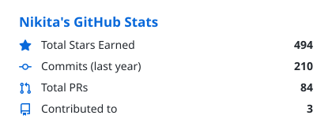
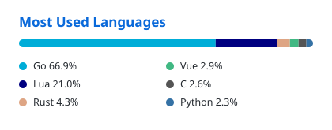

<picture>
  <source media="(prefers-color-scheme: dark)" srcset="https://readme-typing-svg.demolab.com?font=JetBrains+Mono&weight=600&size=26&duration=3000&pause=1000&color=4493F8&repeat=false&width=620&lines=Hi+there%2C+I'm+Nikita+Kriuchkov+%F0%9F%91%8B" />
  
</picture>

> **Senior Software Engineer & Technology Enthusiast** with 18+ years of experience in designing scalable systems and modern applications.

I specialize in constructing high-performance backend systems and immersive frontend experiences. My passion lies in **Golang**, **Rust**, **Python**, **TypeScript** and distributed architectures.

I enjoy combining robust engineering with creative design, as seen in my **cyberpunk** portfolio.

  <picture>
    <source media="(prefers-color-scheme: dark)" srcset="assets/stats-dark.svg" />
    
  </picture>
  <picture>
    <source media="(prefers-color-scheme: dark)" srcset="assets/langs-dark.svg" />
    
  </picture>

## Tech Stack

**Languages**&nbsp;&nbsp;

**Infrastructure**&nbsp;&nbsp;

**Messaging**&nbsp;&nbsp;

## Connect with Me

- **LinkedIn:** [linkedin.com/in/nkriuchkov](https://www.linkedin.com/in/nkriuchkov/)
- **Telegram:** [nkriuchkov](https://t.me/nkriuchkov)
- **Website:** [kriuchkov.com](https://kriuchkov.com)

<!--
**kriuchkov/kriuchkov** is a ✨ _special_ ✨ repository because its `README.md` (this file) appears on your GitHub profile.
-->
